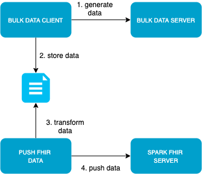

# FHIR Framework

Fhir server to download generated patient's data. It consist of the following components:  

**[Fhir Server](https://github.com/FirelyTeam/spark/)**   
The Fhir Server implements FHIR specification, exposes a REST API to access FHIR data.   

**MongoDB**   
This database is used by the Fhir Server to store the information.   

**[Bulk Data Server](bulk-data-server/)**  
Exposes an API to generate Fhir resources.   

**[Bulk Data Client](bulk-data-client/)**
Consumes the API of the bulk data server and saves it locally.   

**[Push Data](push-data/)**
A python script to push resources files to an Fhir Server.    

   

## Execution 

```bash 
	docker-compose up  
```   

You can access to the server at [http://localhost:5555/](http://localhost:5555/).   

## Docker compose 

The file [docker-compose.yml](docker-compose.yml) starts each of the components as a docker container.      

In this file you can configure the environment variables such as user and password for the database and the server url. In each section you can find more information for each component. 